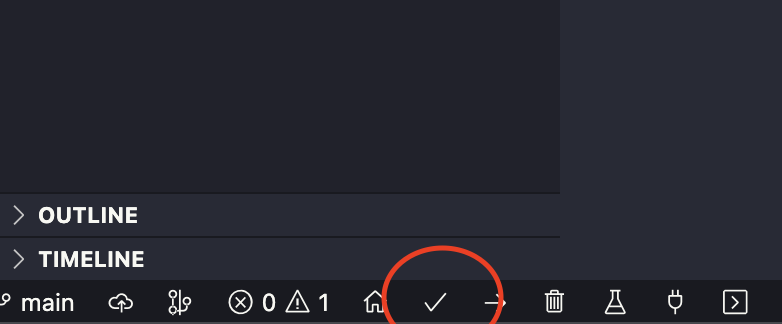
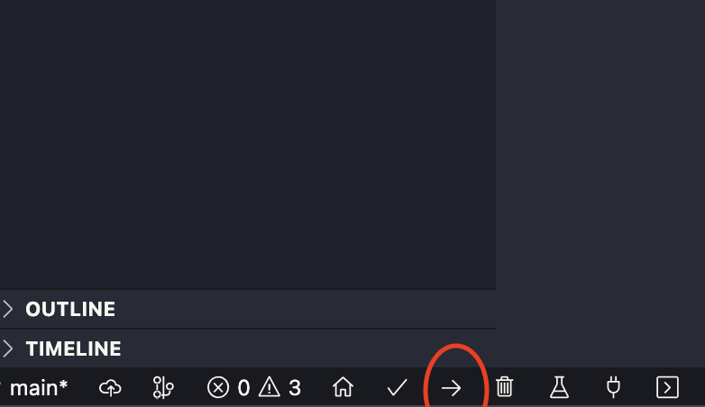

# ESP32 - MQTT

- Aluno: Caio Vinicius Fernandes de Araujo
- Matrícula: 17/0138798

## Requisitos do projeto

- GCC
- VsCode
- PlatformIO (Biblioteca do VsCode)
- ESP32 (Placa utilizada para o desenvolvimento)
- DHT11 (Sensor de umidade e temperatura)
- KY-037 (Sensor de detecção de som)

## Ambiente de desenvolvimento

- OS: MacOS Ventura 13.0
- Chip: M1 pro - ARM

## Como executar o projeto

O passo a passo considera que todos os requisitos do projeto foram cumpridos.

1. Conectar a placa ESP32 ao computador

2. Abrir o diretório do projeto utilizando o editor de texto VsCode

3. Com ajuda das ferramentas da biblioteca PlatformIO, compilar o código do projeto

4. Utilizando das ferramentas da biblioteca PlatformIO, faça upload do código para a placa (é necessário pressionar o botão de boot para ativar o modo download)

5. Agora basta reconectar e conectar novamente a placa do computador para o firmware implementado entrar em vigor

6. Acesse o dashboard do [ThingsBoard](http://164.41.98.25:443/) para ações relacionadas à placa.
